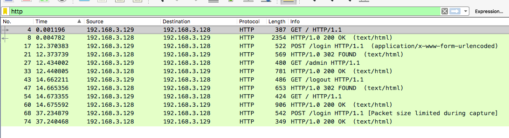
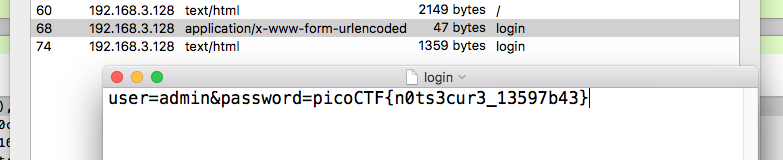

# Admin panel - 150 points

We captured some [traffic](https://2018shell1.picoctf.com/static/ee6ed2afe1da153ae06e61d5ee26d52d/data.pcap) logging into the admin panel, can you find the password?

Hint: Tools like wireshark are pretty good for analyzing pcap files.

### Solution
###### Writeup by asinggih

I opened up the pcap file, and sorted it according to the protocol. I did this because I wanted to start searching for the flag from http requests (GET & POST stuffs).

I inspected all of the http requests starting with the POST and it's reply from the server, since it's the usual method to be used in forms submissions. After examining both the POST and GET, as well as its corresponding replies, I didn't seem to find any flags. However, packet number 74 contains a html with an admin dashboard. So the request of this response, which is packet number 68, should've contained something related to the admin login. I looked deeper into packet number 68 by exporting that particular http object, and found the flag of this challenge.

## Flag
>picoCTF{n0ts3cur3_13597b43}

