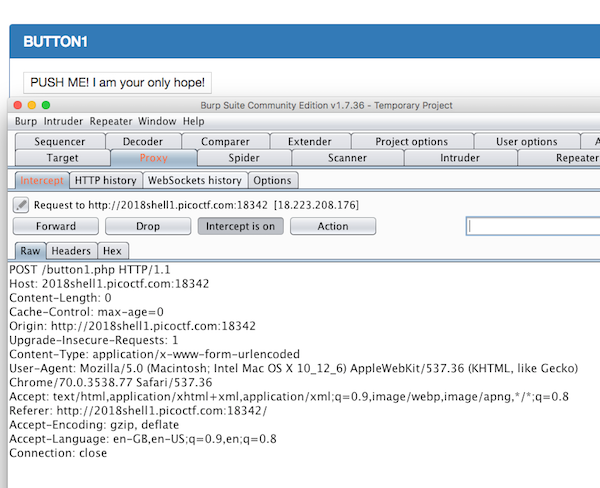
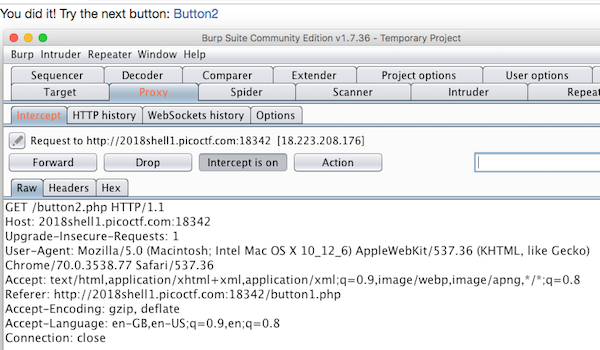
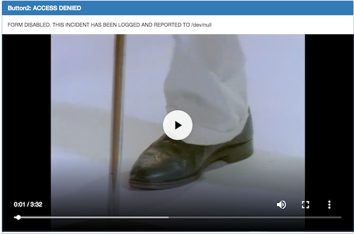

# Buttons - 250 points

There is a website running at [link](http://2018shell1.picoctf.com:18342). Try to see if you can push their buttons.

Hint: What's different about the two buttons?

### Solution
###### Writeup by asinggih

Visiting the link gives us a button to push

<p align="center">
	
</p>

and this is its source:
```html
<!doctype html>
<html>
<head>
    <title>Buttons!</title>
    <link rel="stylesheet" type="text/css" href="//maxcdn.bootstrapcdn.com/bootstrap/3.3.5/css/bootstrap.min.css">
</head>
<body>
<div class="container">
    <div class="row">
        <div class="col-md-12">
            <div class="panel panel-primary" style="margin-top:50px">
                <div class="panel-heading">
                    <h3 class="panel-title">BUTTON1</h3>
                </div>
                <div class="panel-body">
                    <form action="button1.php" method="POST">
                        <input type="submit" value="PUSH ME! I am your only hope!"/>
                    </form>
                </div>
            </div>
        </div>
    </div>
</div>
</body>
</html>
```
so what we can see is that the button in the screenshot above is actually a form submit button.

After clicking that button, we're linked to another page.

<p align="center">
	
</p>

and below is the corresponding source:

```html
<!doctype html>
<html>
<head>
    <title>Buttons!</title>
    <link rel="stylesheet" type="text/css" href="//maxcdn.bootstrapcdn.com/bootstrap/3.3.5/css/bootstrap.min.css">
</head>
<body>
<div>
    You did it! Try the next button: <a href="button2.php">Button2</a>
</div>
</body>
</html>
```

Proceeding with the button2 links us to another page which contains a Rick Astley video. Lol Rickrolled. no flag.

<p align="center">
    
</p>

Looking at what we have so far, and the hint, we know that there's a difference between the two "buttons". The first one is a real button, which is a submission link button, and the second one is actually a link. Form submissions are normally handled using the POST action as we can see in the 1st button's source code as well as the intercepted http request, while normal link us handled by GET request.

Modifying the 2nd button's http request into POST, give us the flag!
```sh
POST /button2.php HTTP/1.1
Host: 2018shell1.picoctf.com:18342
Upgrade-Insecure-Requests: 1
User-Agent: Mozilla/5.0 (Macintosh; Intel Mac OS X 10_12_6) AppleWebKit/537.36 (KHTML, like Gecko) Chrome/70.0.3538.102 Safari/537.36
Accept: text/html,application/xhtml+xml,application/xml;q=0.9,image/webp,image/apng,*/*;q=0.8
Referer: http://2018shell1.picoctf.com:18342/button1.php
Accept-Encoding: gzip, deflate
Accept-Language: en-GB,en-US;q=0.9,en;q=0.8
Connection: close
```

## Flag
>picoCTF{button_button_whose_got_the_button_25a99f84}

