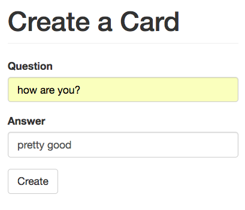
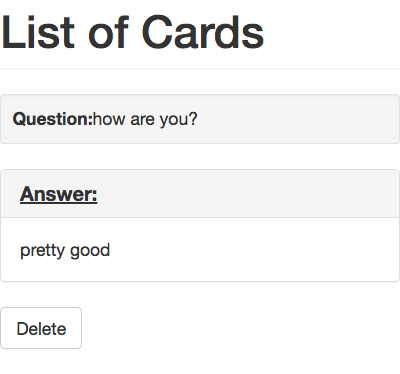
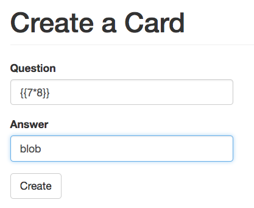
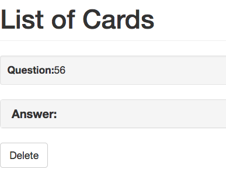
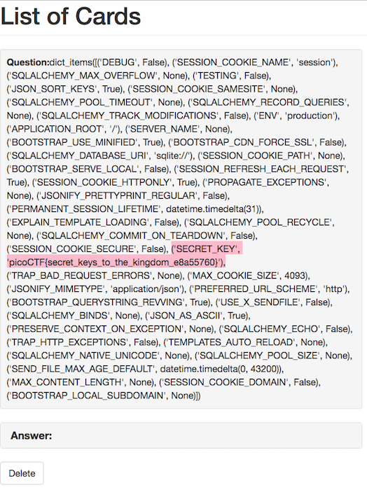

# Flaskcards - 350 points

We found this fishy [website](http://2018shell1.picoctf.com:51878/) for flashcards that we think may be sending secrets. Could you take a look ?

Hints:

* Are there any common vulnerabilities with the backend of the website?
* Is there anywhere that filtering doesn't get applied?

### Solution
###### Writeup by asinggih

The given website allows us to create flash cards, and look at the list of the flash cards. 

	
	

At the beginning, I thought it's challenge related to XSS. However, according to the hints, it's about a backend vulnerability. Given the name, of the challenge, it must've been using Flask at the backend. So I googled Flask vulnerabilites, and found several good materials:

1. [Injecting flask](https://nvisium.com/blog/2015/12/07/injecting-flask.html) by Ryan Reid
2. [Server-Side Template Injection](https://portswigger.net/blog/server-side-template-injection) by James Kettle
3. [Exploring SSTI in Flask/Jinja2](https://nvisium.com/blog/2016/03/09/exploring-ssti-in-flask-jinja2.html) by Tim Tomes

Combining the info from the materials above, and the hints, i tried the template injection in this particular challenge. 
I did this by inserting `{{7 * 8}}` in the card creation form, and check it in the list of cards. Basically if the web app is vulnerable to template injection, it will execute what we put in the curly braces, instead of displaying it as it is.

	
	

From the list of cards,it can be seen that my `{{7 * 8}}` input was executed by the server. Hence, it can be said that this web app is vulnerable to template injection. Therefore, we can basically make the web app execute some Python commands. For Flask, we can learn more about the web app via its configuration file via `{{config.items()}}`. Inputing this to the card creation gives us the whole configuration items of the Flask app in the cards list, which also includes the flag.

	

## Flag
>picoCTF{secret_keys_to_the_kingdom_e8a55760}
