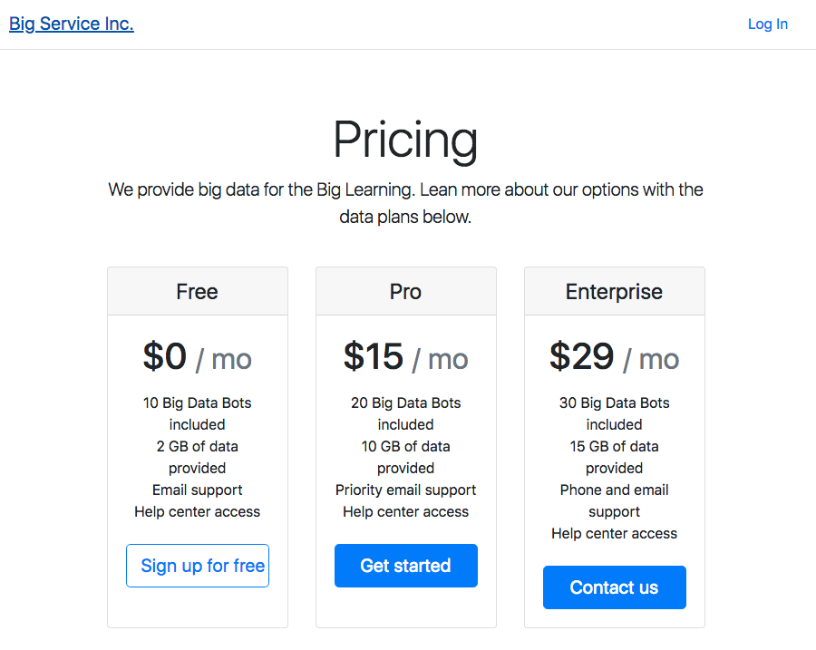
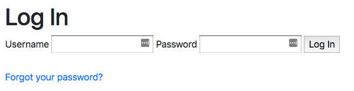
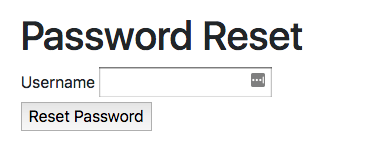
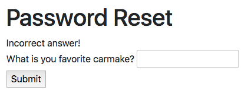
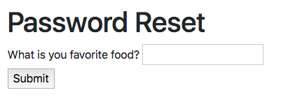
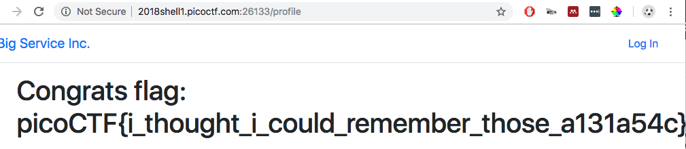

# Help Me Reset - 600 points

There is a website running at [link](http://2018shell1.picoctf.com:26133). We need to get into any user for a flag!

Hints: Try looking past the typical vulnerabilities. Think about possible programming mistakes.

### Solution
###### Writeup by asinggih

None of the links at the given website are working, but the Login button. 

<p align="center">
	
</p>

As always, i tried to log in using `admin` / `password`. Didn't work. The interesting thing about this challenge, as opposed to any other challenges with the login form, is that we have a "forgot your password" option.

<p align="center">
	
</p>

Clicking on the "forgot your password" takes us to the password reset form. However, we need to have to username, in order to reset the password. Again, I tried `admin` as the username, but apparently it doesn't exist. 

<p align="center">
	
</p>

Hence, I tried to look for the username within this website. After trying to see the content using "view source" on each of the pages, I found a commented out section with the name of the website maintainer, which is placed at the very end of the home page's source code.

```html
...
        </div>
        </div>
    </div>
</div>
<!--Proudly maintained by brewer-->

  </div>
</section>
```

Using that username on the forgot password feature took me to the next step of reseting the password, which is to answer the secret question. After trying it several times, I figured that there are 4 different types of secret questions, which was given out randomly. The questions are:

1. Favourite Carmake ?
2. Favourite Colour ?
3. Favourite Food ?
4. Favourite Superhero ?

If we answered the questions wrong for 3 times, the account will be locked out, and we had to refresh the source code in the home page to get a new user.

Getting the correct answer is pure luck, and the way I did it is to stick to one question, which was the "favourite colour" question, and keep using "red" as the answer for all different username. However, the real challenge is to figure out about the vulnerability in this challenge, and exploit it.

After doing the questions for several runs, I realised that the wrong answer will show "incorrect answer" on the next question set, while the correct ones will not show anything.

<p align="center">
	
	
</p>

Once i get a user whose favourite colour is red, I kept refreshing the page, until the system gives me the favourite colour question again. I kept doing this for 3 times, and finally, it gave me the password reset link, and logging in with the username, and the new password gave me the flag

<p align="center">
	
</p>


## Flag
>picoCTF{i_thought_i_could_remember_those_a131a54c}

