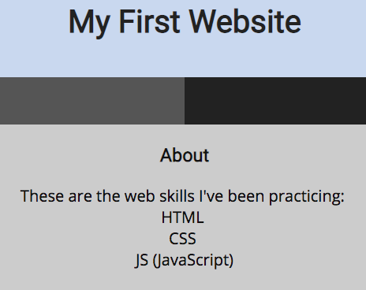
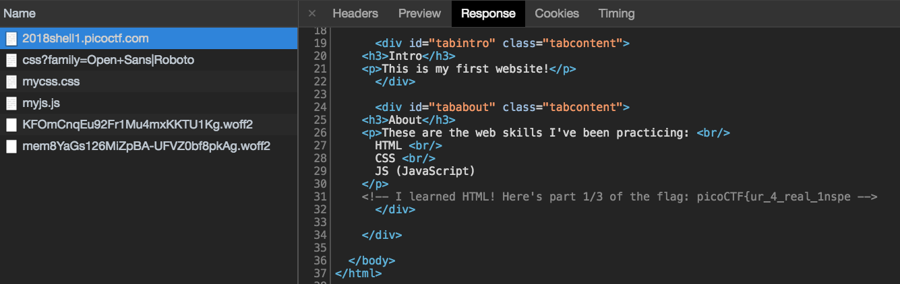
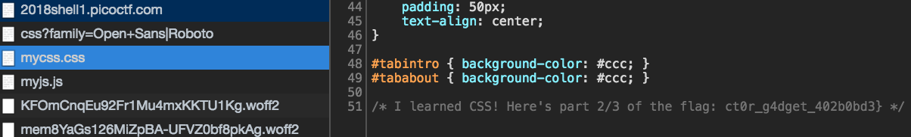
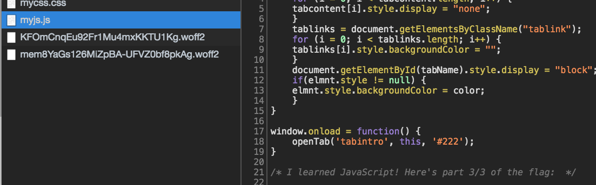

# Inspect Me - 125 points

Inpect this code! [link](http://2018shell1.picoctf.com:53213)

Hints:

- How do you inspect a website's code on a browser?
- Check all the website code.

### Solution
###### Writeup by asinggih

From the website, we can see that the dev of this particular site is currently learning HTML, CSS, and Javascript. First thing that I always do on web challenges is to check the source code, especially after the hints specifically told us to check all the website code. 

Hence, In Chrome dev tools I went to the network tab, and check the response of that site.

It can be seen that at the bottom of the HTML code, there's a commented out section with a partial flag.
According to the content of the website that we see in the first image, the dev is also learning CSS and Javascript. Therefore, I checked the "mycss.css" file to get the next part of the flag

The final part of the flag should be located inside the myjs.js file. However, in my case, the flag was completed after inspecting the css file.

## Flag
>picoCTF{ur_4_real_1nspect0r_g4dget_402b0bd3}

