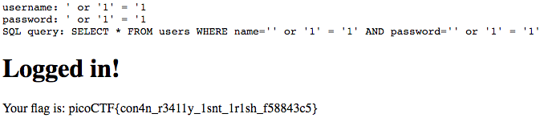

# Irish Name Repo - 200 points

There is a website running at [link](http://2018shell1.picoctf.com:28402). Do you think you can log us in? Try to see if you can login!

Hint: There doesn't seem to be many ways to interact with this, I wonder if the users are kept in a database?

### Solution
###### Writeup by asinggih

The website shows pictures of actors (Irish?). Upon clicking the menu bar, we can see 2 other pages, which are the support page and the admin login page. One of the comments inside the support page hints SQL injection, which strengthen the hint of this challenge that mentions users being kept in database. 

The admin login page is just a standard username and password login form. I tested  ```admin``` as username and ```password``` as password to test my luck. Failed.

Next step that i did was to use a basic SQL injection query ```' or '1'='1```. I used this on both the username and admin, and gave me admin access, along with the flag.

<p align="center">
	
</p>

**Note:** SQL query can be displayed by modifying the debug value into ```1``` from the HTTP request using burpsuit.


## Flag
>picoCTF{con4n_r3411y_1snt_1r1sh_f58843c5}

