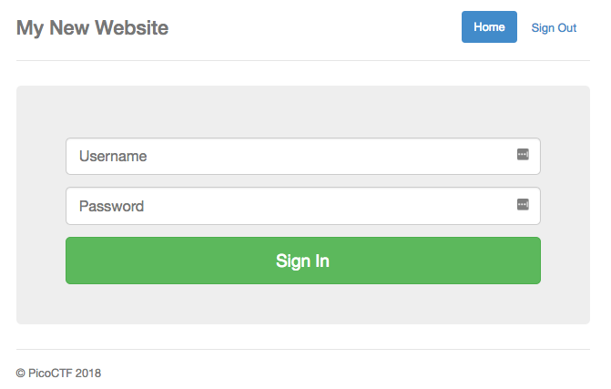
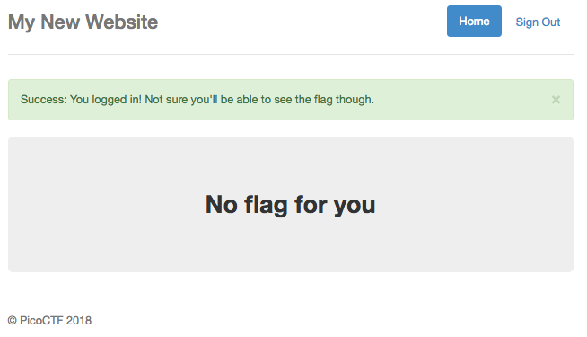
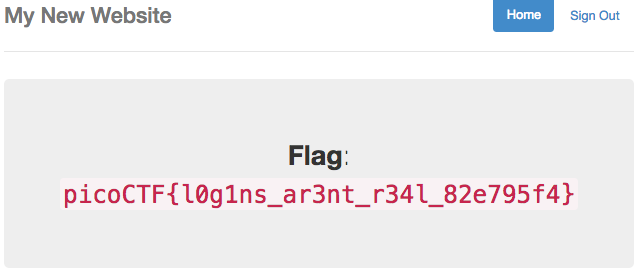

# Logon - 150 points

I made a website so now you can log on to! I don't seem to have the admin password. See if you can't get to the flag. [link](http://2018shell1.picoctf.com:6153)

Hints:

-  Hmm it doesn't seem to check anyone's password, except for admins?
- How does check the admin's password?


### Solution
###### Writeup by asinggih

We're presented with a standard login form, and we can always login with any random credentials, but a flag won't be displayed.

<p align="center"></p>

<p align="center"></p>

The sourcecode also does not show anything interesting. Hence, what i did next was to intercept the HTTP request using burpsuite, and see the request. Intercepting the login process gave me the request below:

```sh
GET /flag HTTP/1.1
Host: 2018shell1.picoctf.com:6153
Cache-Control: max-age=0
Upgrade-Insecure-Requests: 1
User-Agent: Mozilla/5.0 (Macintosh; Intel Mac OS X 10_12_6) AppleWebKit/537.36 (KHTML, like Gecko) Chrome/70.0.3538.77 Safari/537.36
Accept: text/html,application/xhtml+xml,application/xml;q=0.9,image/webp,image/apng,*/*;q=0.8
Referer: http://2018shell1.picoctf.com:6153/
Accept-Encoding: gzip, deflate
Accept-Language: en-GB,en-US;q=0.9,en;q=0.8
Cookie: password=; username=didi; admin=False
Connection: close
```

Changing the value of admin into True, logs us in as the admin

<p align="center"></p>


## Flag
>picoCTF{l0g1ns_ar3nt_r34l_82e795f4}

