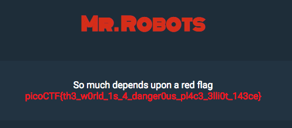

# Mr. Robots - 200 points

Do you see the same things I see? The glimpses of the flag hidden away? [link] (http://2018shell1.picoctf.com:10157)

Hint: What part of the website could tell you where the creator doesn't want you to look?

### Solution
###### Writeup by asinggih

It took me some time to figure out this challenge. I inspected the code using chrome dev tools, but I couldn't find anything! Then I checked the hint, and it all made sense. Robots.txt is a list of items in our website that we don't want to be "scanned" by web crawlers, such as search engines for example. 

Inside `http://2018shell1.picoctf.com:10157/robots.txt`:

```
User-agent: *
Disallow: /143ce.html
```

We can see that `http://2018shell1.picoctf.com:10157/143ce.html` is being excluded from the web crawlers. Accessing that link gave me the flag.

<p align="center"></p>


## Flag
>picoCTF{th3_w0rld_1s_4_danger0us_pl4c3_3lli0t_143ce}

