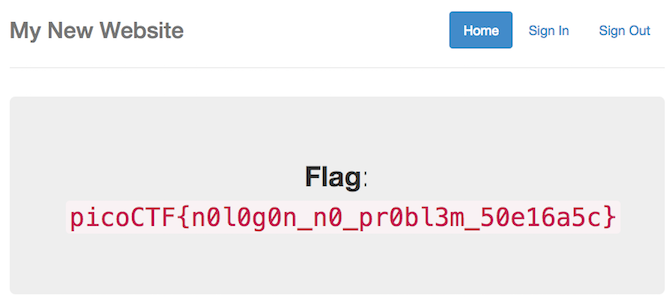

# No Login - 200 points

Looks like someone started making a website but never got around to making a login, but I heard there was a flag if you were the admin. [link](http://2018shell1.picoctf.com:39670)

Hint: What is it actually looking for in the cookie?

### Solution
###### Writeup by asinggih

The current challenge is kind of similar to [logon](/logon.md). We're given a website, where we can login as admin to retrieve the flag. 
However, there's a catch. The login form isn't implemented yet. Lol.

<p align="center">
	
</p>

If we click the flag button, it gives us a flash message saying that we're not 
the admin.

<p align="center">
	
</p>

Using the same approach as I did in [logon](/logon.md), I intercepted the http request of [flag link](http://2018shell1.picoctf.com:39670/flag) using Burpsuite, 
and modify it's cookies (as it has been hinted in this challenge). 

<p align="center">
	
</p>

First i decoded the base64 session cookie to see if there's anything important. Nothing. It was just the flash message decode in base64 form.
After that I added the admin item inside the parameter tab, initially i tried ```1``` as the value, no flag. Tried again with ```true``` and it logged
me in as admin.

<p align="center">
	
</p>

## Flag
>picoCTF{n0l0g0n_n0_pr0bl3m_50e16a5c}

