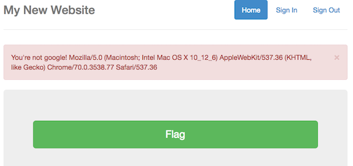
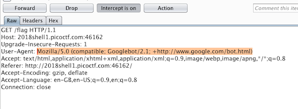
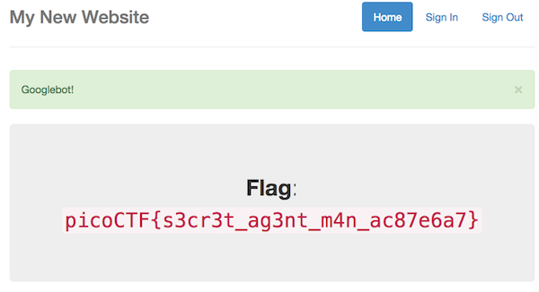

# Secret Agent - 200 points

Here's a little website that hasn't fully been finished. But I heard google gets all your info anyway. [link](http://2018shell1.picoctf.com:46162)

Hint: How can your browser pretend to be something else?

### Solution
###### Writeup by asinggih

Again, we're given a website with a big green flag button in the middle. When we click it, we received a flash message mentioning that we're not Google, along with our browser's user-agent. 

<p align="center">
	
</p>

From the hint and the message, it can said that we need to pretend to be Google, to actually access the flag. Hence i searched for "Google's user agent". One of the search results gave me a list of Googlebot user agents, along with the popularity level. I picked the one with the highest popularity, and replaced my original user agent using this Googlebot's via burp.

```Mozilla/5.0 (compatible; Googlebot/2.1; +http://www.google.com/bot.html)```

<p align="center">
	
</p>

After forwarding the http request, the website gave me the flag, and identified me as Googlebot.

<p align="center">
	
</p>


## Flag
>picoCTF{s3cr3t_ag3nt_m4n_ac87e6a7}

