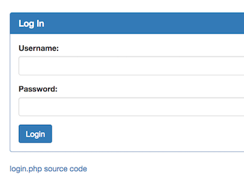

# The Vault - 250 points

There is a website running at [link](http://2018shell1.picoctf.com:49030). Try to see if you can login!

Hint: No hint

### Solution
###### Writeup by asinggih

<p align="center">
	
</p>

Visiting the link gives us another login form. However, this time, the source code of this current page is also provided for us.

```php
<?php
  ini_set('error_reporting', E_ALL);
  ini_set('display_errors', 'On');

  include "config.php";
  $con = new SQLite3($database_file);

  $username = $_POST["username"];
  $password = $_POST["password"];
  $debug = $_POST["debug"];
  $query = "SELECT 1 FROM users WHERE name='$username' AND password='$password'";

  if (intval($debug)) {
    echo "<pre>";
    echo "username: ", htmlspecialchars($username), "\n";
    echo "password: ", htmlspecialchars($password), "\n";
    echo "SQL query: ", htmlspecialchars($query), "\n";
    echo "</pre>";
  }

  //validation check
  $pattern ="/.*['\"].*OR.*/i";
  $user_match = preg_match($pattern, $username);
  $password_match = preg_match($pattern, $username);
  if($user_match + $password_match > 0)  { 
    echo "<h1>SQLi detected.</h1>";
  }
  else {
    $result = $con->query($query);
    $row = $result->fetchArray();
    
    if ($row) {
      echo "<h1>Logged in!</h1>";
      echo "<p>Your flag is: $FLAG</p>";
    } else {
      echo "<h1>Login failed.</h1>";
    }
  }
  
?>
```

Looking at the source code, it can be seen that regular expression of ```$pattern``` will filter commonly used ``` ' or '1'='1 ``` 
SQL injection script, and they will do to the validation by comparing them with the username input:

```php 
$user_match = preg_match($pattern, $username);
```

and (supposedly) the password input:

```php 
$password_match = preg_match($pattern, $username);
```
However, it seems that the developer forgot to change ```$username``` into ```$password``` in the ```$password_match``` validation.
Therfore, as long as we only put our SQL injection script in the password input box, it falls into the ```else``` block in
the condition below, since ```$user_match``` and ```$password_match``` will both return 0.

```php
$user_match = preg_match($pattern, $username);
$password_match = preg_match($pattern, $username);
if($user_match + $password_match > 0)  { 
    echo "<h1>SQLi detected.</h1>";
}
else {
	.....
}
```

As a result, we can just leave the username input empty, and put ``` ' or '1'='1 ``` in our password input box, and then voila!


## Flag
>picoCTF{w3lc0m3_t0_th3_vau1t_c4738171}

